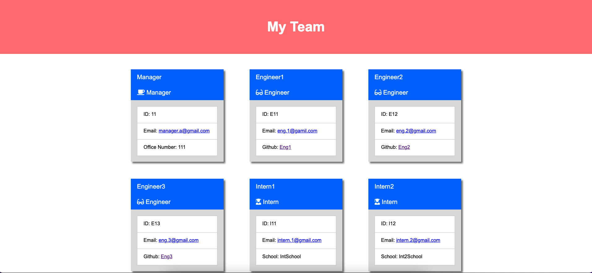

[](https://opensource.org/licenses/MIT)

<br />
<div align="center">
  <h3 align="center">Team Profile Generator</h3>

  <p align="center">
    This CLI app will generate a team profile following a preset format.
    <br />
    <a href="https://github.com/heranYang93/team-profile-generator/blob/main/demo/demo.mp4">View Demo</a>
    ·
    <a href="https://github.com/heranyang93/team-profile-generator/issues">Report Bug</a>
    ·
    <a href="https://github.com/heranyang93/team-profile-generator/issues">Request Feature</a>
  </p>
</div>

<details>
  <summary>Table of Contents</summary>
  <ol>
    <li>
      <a href="#about-the-project">About The Project</a>
      <ul>
        <li><a href="#user-story">User Story</a></li>
        <li><a href="#acceptance-criteria">Acceptance Criteria</a></li>
        <li><a href="#built-with">Built With</a></li>
      </ul>
    </li>
    <li>
      <a href="#getting-started">Getting Started</a>
      <ul>
        <li><a href="#prerequisites">Prerequisites</a></li>
        <li><a href="#installation">Installation</a></li>
      </ul>
    </li>
    <li><a href="#usage">Usage</a></li>
    <li><a href="#license">License</a></li>
    <li><a href="#contact">Contact</a></li>
    <li><a href="#acknowledgments">Acknowledgments</a></li>
  </ol>
</details>

## About The Project



This Node.js command-line application is built to take in information about employees on a software engineering team, then generates an HTML webpage that displays summaries for each person.

Testing is key to making code maintainable, so tests have been organised to ensure that the app passes each criteria.

<p align="right">(<a href="#top">back to top</a>)</p>

### User Story

```md
AS A manager
I WANT to generate a webpage that displays my team's basic info
SO THAT I have quick access to their emails and GitHub profiles
```

<p align="right">(<a href="#top">back to top</a>)</p>

### Acceptance Criteria

GIVEN a command-line application that accepts user input

- WHEN I am prompted for my team members and their information
  `THEN an HTML file is generated that displays a nicely formatted team roster based on user input`

- WHEN I click on an email address in the HTML
  `THEN my default email program opens and populates the TO field of the email with the address`

- WHEN I click on the GitHub username
  THEN that GitHub profile opens in a new tab

- WHEN I start the application
  `THEN I am prompted to enter the team manager’s name, employee ID, email address, and office number`

- WHEN I enter the team manager’s name, employee ID, email address, and office number
  `THEN I am presented with a menu with the option to add an engineer or an intern or to finish building my team`

- WHEN I select the engineer option
  `THEN I am prompted to enter the engineer’s name, ID, email, and GitHub username, and I am taken back to the menu`

- WHEN I select the intern option
  `THEN I am prompted to enter the intern’s name, ID, email, and school, and I am taken back to the menu`
- WHEN I decide to finish building my team
  `THEN I exit the application, and the HTML is generated`

<p align="right">(<a href="#top">back to top</a>)</p>

### Built With

The following dependencies/resources have been used:

- [Node.js](https://nodejs.org/en/)
- [Inquirer.js](https://www.npmjs.com/package/inquirer)
- [Jest](https://jestjs.io/)
- [Fontawesome](https://fontawesome.com/)

<p align="right">(<a href="#top">back to top</a>)</p>

## Getting Started

### Prerequisites

- Node and NPM must be installed prior to initiating the app

### Installation

- Install all necessary dependencies
  - Inquirer and Jest must be installed
  - Point the terminal to the main directory and run the following command
  ```sh
  npm i
  ```

<p align="right">(<a href="#top">back to top</a>)</p>

## Usage

- run the following command

  ```
  node run index.js
  ```

- Follow the prompted questions
- Find the generated page in

  ```
  ./dist/pages/index.html
  ```

- Should you want to deploy the page, copy the following folders as well as their content into the directory of your selection

  ```
  ./dist/pages
  ./dist/style
  ```

<p align="right">(<a href="#top">back to top</a>)</p>

## License

Distributed under the MIT License. See `LICENSE` for more information.

<p align="right">(<a href="#top">back to top</a>)</p>

## Contact

Heran Yang- [LinkedIn](https://www.linkedin.com/in/heranyang/)

Project Link: [https://github.com/heranyang93/team-profile-generator](https://github.com/heranyang93/team-profile-generator)

<p align="right">(<a href="#top">back to top</a>)</p>

## Acknowledgments

- [Img Shields](https://shields.io)
- [GitHub Pages](https://pages.github.com)
- [Font Awesome](https://fontawesome.com)
